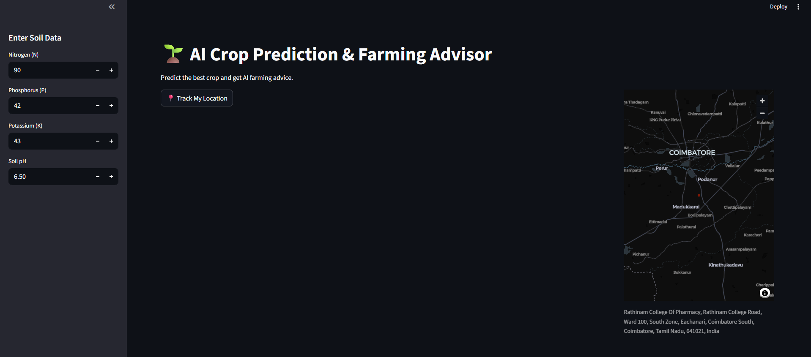
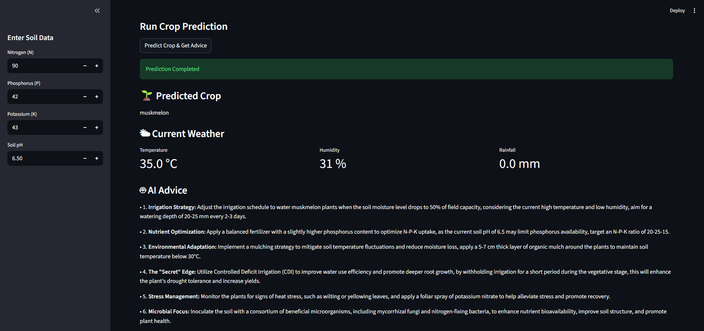

# 🌱 AI Crop Prediction & Farming Advisor

An intelligent **AI-powered agriculture assistant** that predicts the most suitable crop based on **soil nutrients, location, and real-time weather conditions**.  
The system automatically detects the user's **GPS location**, retrieves **live weather data**, predicts the **best crop using Machine Learning**, and generates **AI farming advice** using Large Language Models.

This project demonstrates the integration of:

- Machine Learning
- LLM-based AI agents
- Real-time weather APIs
- Geolocation services
- Interactive web UI with Streamlit

---

# 🚀 Features

✅ **Automatic Location Detection**  
Users can detect their GPS location directly from the browser.

✅ **Live Weather Integration**  
Temperature, humidity, and rainfall are retrieved dynamically from a weather API.

✅ **Crop Prediction Model**  
A trained **Machine Learning model (Scikit-Learn)** predicts the most suitable crop using soil and weather data.

✅ **AI Farming Advisor**  
An LLM agent generates farming advice including:

- Soil preparation
- Fertilizer recommendations
- Irrigation guidance
- Crop management tips

✅ **Interactive Map Visualization**  
Displays the user's current location on a map.

---

# 🧠 System Architecture

```
User Input (Soil Data + Location)
        │
        ▼
Geolocation Detection (Browser)
        │
        ▼
Weather API (Open-Meteo)
        │
        ▼
Crop Prediction Model (Scikit-Learn)
        │
        ▼
LangGraph AI Agent
        │
        ▼
AI Farming Advice
        │
        ▼
Streamlit Web Interface
```

---

# 🖥️ Application Preview

## 📍 Location Detection & Map

The application detects the user's location and displays it on an interactive map.



---

## 🤖 AI Generated Farming Advice

After predicting the crop, the AI agent generates intelligent farming recommendations.



---

# 🛠️ Tech Stack

### Languages
- Python

### Machine Learning
- Scikit-Learn
- Joblib

### AI / LLM Framework
- LangGraph
- LangChain
- Groq LLM

### APIs
- Open-Meteo Weather API
- OpenStreetMap Reverse Geocoding

### Frontend / UI
- Streamlit
- PyDeck (Map visualization)

### Other Tools
- Pandas
- Requests
- Python Dotenv

---

# 📂 Project Structure

```
AI-Crop-Advisor
│
├── app.py                 # Streamlit UI
├── agri_agent.py          # LangGraph AI workflow
├── crop_model.pkl         # Trained ML model
├── requirements.txt       # Project dependencies
│
├── images
│   ├── map.png
│   └── ai_advice.png
│
└── README.md
```

---

# ⚙️ Installation

Clone the repository:

```bash
git clone https://github.com/your-username/ai-crop-advisor.git
cd ai-crop-advisor
```

Install dependencies:

```bash
pip install -r requirements.txt
```

---

# ▶️ Run the Application

```bash
streamlit run app.py
```

The application will start at:

```
http://localhost:8501
```

---

# 📊 Input Parameters

The crop prediction model uses the following features:

| Feature | Description |
|------|------|
| N | Nitrogen level in soil |
| P | Phosphorus level |
| K | Potassium level |
| pH | Soil acidity |
| Temperature | Current weather temperature |
| Humidity | Current humidity |
| Rainfall | Current precipitation |

Weather parameters are automatically retrieved using **latitude and longitude**.

---

# 🌍 Real World Use Case

This system can help:

- Farmers choose the **most suitable crop**
- Improve **yield prediction**
- Provide **AI-based farming guidance**
- Support **precision agriculture**

---

# 📈 Future Improvements

- Satellite soil data integration
- Multi-crop recommendations
- Seasonal yield prediction
- Soil image analysis
- Mobile app version

---

# 👨‍💻 Author

**Sri Nitish**

B.Tech Information Technology  
AI / Machine Learning Enthusiast  

---

# ⭐ If you like this project

Give it a **star ⭐ on GitHub** to support the work!
